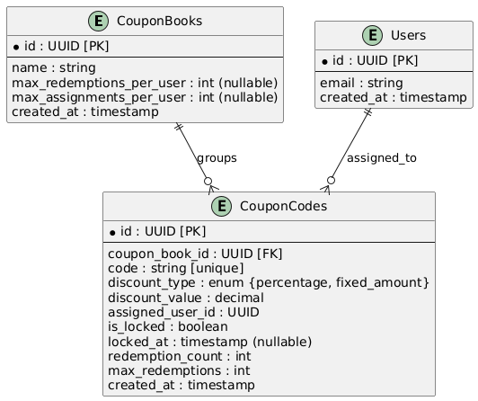
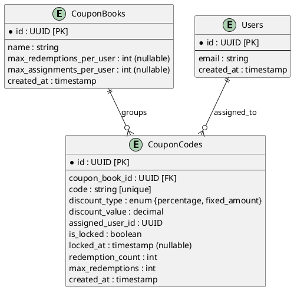

# Resolution study case

I always like to start by understanding the problem and the requirements. This is a good way to start the design process.

<u>**I was told on the interview process that I have to complete this challenge in 48hrs, and should take 2hrs tops. The challenge
sent to me on Tuesday, so I assume I have to deliver it on Thursday. I'm working a full time job therefore I can't dedicated more than those 2 hours. 
I will cut some corners, leave stuff incompleted, and It might be some errors/mistakes. **</u>

## Thinking process

I will take this suggestion described on the case study:

```
You  are  welcome  to  introduce  any  necessary  constraints  or  assumptions  to
streamline the process and ensure the delivery of a more complete solution.
```

So business wise, I will assume: 

- That the coupons are unique and the user can redeem x amount of times each coupon.
- The coupons belongs to a coupon book, like a campaign. (Or similar)
- I'm not sure if the coupon book has discounts or any other info. So I will asume that the coupon book is just a group for the coupons.
- The discount percentage or money is on the coupon (using a flag to indicate if it is a percentage or a fixed amount)
- The currency is unique for the system.

### Data Structure

I would use a SQL database, because it is a good fit for this kind of data. I would use a relational database because the data is structured and the relationships are clear.
Also ACID properties are important for this kind of system, where the data integrity and transactions are important.



(if necessary, we can change the diagram an recreate the image)


This might miss some details, because I'm not sure about the requirements and/or <u>**specific business edge cases**</u>.


### API Endpoints

POST /coupons

**Request**:```{ "name": "Summer2025", "max_redemptions_per_user": 1, "max_assignments_per_user": 3 }```

**Response**: ```{ "coupon_book_id": "123e4567-e89b-12d3-a456-426614174000" }``` 

POST /coupons/codes

**Request**: ```{ "coupon_book_id": "...", "codes": ["CODE123", "CODE124"] }```

**Response**: ```{ "uploaded_codes_count": 2 }```

POST /coupons/assign

**Request**: ```{ "user_id": "...", "coupon_book_id": "..." }```

**Response**: ```{ "assigned_code": "CODE123" }```

POST /coupons/assign/{code}

**Request**: ```{ "user_id": "..." }```

**Response**: ```{ "assigned_code": "CODE124" }```

POST /coupons/lock/{code}

**Request**: ```{ "user_id": "..." }```

**Response**: ```{ "status": "locked" }```

POST /coupons/redeem/{code}

**Request**: ```{ "user_id": "..." }```

**Response**: ```{ "status": "redeemed" }```

GET /users/{user_id}/coupons

**Response**: ```{ "assigned_coupons": ["CODE123", "CODE124"] }```


### Pseudocode Critial Operations

Assign Coupon Code:
```
begin transaction
fetch random available coupon from CouponCodes where assigned_user_id is NULL limit 1 for update
if coupon exists:
    assign coupon to user (update assigned_user_id)
commit transaction
```

Lock Coupon:
```
begin transaction
select coupon for update
if coupon.assigned_user_id == user_id and not coupon.is_locked and not coupon.is_redeemed:
    set coupon.is_locked = True, locked_at = now()
commit transaction
```

Redeem Coupon:
```
begin transaction
select coupon for update
if coupon.assigned_user_id == user_id and coupon.is_locked and not coupon.is_redeemed:
    set coupon.is_redeemed = True, redeemed_at = now(), is_locked = False
commit transaction
```

### Concurrency Handling

- Use database transactions and row-level locking (SELECT FOR UPDATE) to handle concurrent redemption.

Pseudocode how to handle the concurrency and collisions:

```
BEGIN TRANSACTION

# Attempt to lock coupon exclusively for User A
coupon = SELECT * FROM CouponCodes WHERE code='CODE123' FOR UPDATE;

IF coupon.is_redeemed OR coupon.is_locked:
    # Redemption fails immediately
    RETURN ERROR "Coupon already redeemed or locked"
ELSE IF coupon.assigned_user_id != UserA.id:
    # Coupon not assigned to this user
    RETURN ERROR "Coupon not assigned to user"
ELSE:
    coupon.is_locked = TRUE
    coupon.locked_at = NOW()

COMMIT TRANSACTION

# Complete redemption after temporary lock
BEGIN TRANSACTION

coupon = SELECT * FROM CouponCodes WHERE code='CODE123' FOR UPDATE;

IF coupon.is_locked AND NOT coupon.is_redeemed AND coupon.assigned_user_id == UserA.id:
    coupon.is_redeemed = TRUE
    coupon.redeemed_at = NOW()
    coupon.is_locked = FALSE

COMMIT TRANSACTION
```
 
### Security & Performance Considerations
 
- Implement JWT for authentication.
- Use API Gateway throttling and rate-limiting.
- Ensure proper database indexing (coupon codes, user IDs).

### Cloud Deployment

Usually a prefer to create cloud agnostic solutions. Therefore, I would propose to use k8s with a cloud provider like GCP, AWS or Even Digital Ocean.

- Use a managed database service like Cloud SQL or RDS.
- Deploy the API on a Kubernetes cluster.
- Use a well-known API Gateway like Kong or another not-lock-in solution (like AWS API Gateway).

### Scalability

- The API should be stateless and horizontally scalable.
- On the SQL database could be tricky but using PostgresSQL with a good schema design and indexes should be enough for a while.
- If more scalability is needed, we could use multiple read replicas and sharding.
- In memory caching could be used to reduce database load.

This approach allows to create a good enough solution for the problem, and it is scalable enough if the system grows even more the design should be revisited. 